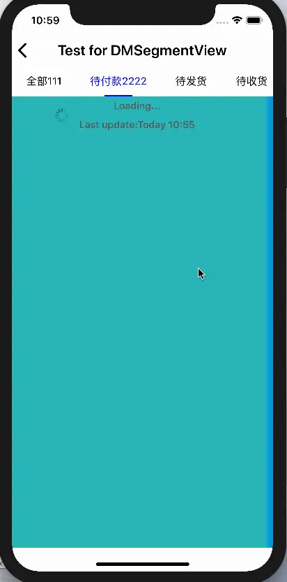

# DMKit 第四篇:DMSegmentView     
- 开发iOS的时候经常用到的分段显示控制view

### 具体内容[GitHub-DMKit](https://github.com/liu5855019/DMKit)




###  DMSegmentView.h
```
/** frame&views 必填   其他非必填 */
- (instancetype)initWithFrame:(CGRect)frame
                        views:(NSArray <UIView *> *)views        //要显示的views
                       titles:(NSArray <NSString *>*)titles      //要显示的titles
                    titleFont:(UIFont *)font                     //默认15
                   titleColor:(UIColor *)titleColor              //默认黑色
           titleSelectedColor:(UIColor *)selectedColor           //默认绿色
              titlesIsAverage:(BOOL)isAve                        //是否根据frameW平均显示titles,如果是:frameW不够显示的时候回用默认空白宽度
                   showAction:(void(^)(NSInteger index))showAction;    //显示回调
```

### 个人觉得还是很好用的,喜欢的可以试一下,已经写好了demo
# 想具体看看的请移驾:[GitHub-DMKit](https://github.com/liu5855019/DMKit)