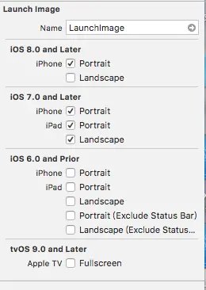

### 启动页默认Launch.storyboard
### 想使用图片的:

1. targets >> general  >> launch images source >> create

2. 进入 Assets.xcassets  设置刚才创建的LaunchImage
  2.1 如图设置或自行按需设置
  
2.2 填入相应图片
2.3 Landscape 是横屏的意思

3. 进入info.plist  删除 Launch选项  这个尤为重要