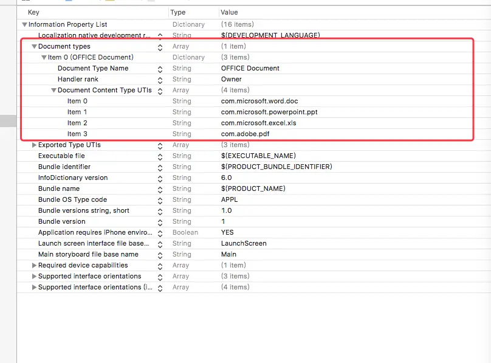
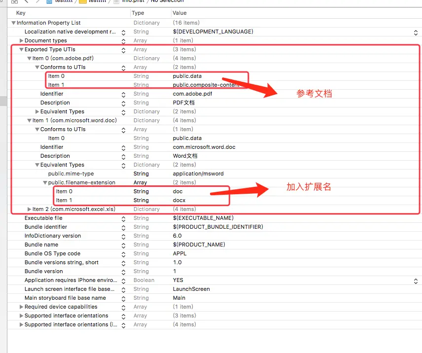

---
# =============== 分享文件 ===============
---
###效果图


### 主要代码
```

- (void)clickRightItem
{
    self.documentController = [UIDocumentInteractionController interactionControllerWithURL:[NSURL fileURLWithPath:_filePath]];
    
    self.documentController.delegate = self;
    
    self.documentController.UTI = [self getUTI];
    
    [self.documentController presentOpenInMenuFromRect:CGRectZero
                                                inView:self.view
                                              animated:YES];

}

- (NSString *)getUTI
{
    NSString *typeStr = [self getFileTypeStr:_filePath.pathExtension];

    if ([typeStr isEqualToString:@"PDF"]) {
        return @"com.adobe.pdf";
    }
    if ([typeStr isEqualToString:@"Word"]){
        return @"com.microsoft.word.doc";
    }
    if ([typeStr isEqualToString:@"PowerPoint"]){
        return @"com.microsoft.powerpoint.ppt";
    }
    if ([typeStr isEqualToString:@"Excel"]){
        return @"com.microsoft.excel.xls";
    }
    return @"public.data";
}


- (NSString *)getFileTypeStr:(NSString *)pathExtension
{
    if ([pathExtension isEqualToString:@"pdf"] || [pathExtension isEqualToString:@"PDF"]) {
        return @"PDF";
    }
    if ([pathExtension isEqualToString:@"doc"] || [pathExtension isEqualToString:@"docx"] || [pathExtension isEqualToString:@"DOC"] || [pathExtension isEqualToString:@"DOCX"]) {
        return @"Word";
    }
    if ([pathExtension isEqualToString:@"ppt"] || [pathExtension isEqualToString:@"PPT"]) {
        return @"PowerPoint";
    }
    if ([pathExtension isEqualToString:@"xls"] || [pathExtension isEqualToString:@"XLS"]) {
        return @"Excel";
    }
    return @"其它";
}

```

###分享文件结束  End

---
#=========== 接收文件 实现步骤 ============
---
####1. 在info.plist 中新增key : CFBundleDocumentTypes

```
<key>CFBundleDocumentTypes</key>
	<array>
		<dict>
			<key>CFBundleTypeName</key>
			<string>OFFICE Document</string>
			<key>LSHandlerRank</key>
			<string>Owner</string>
			<key>LSItemContentTypes</key>
			<array>
				<string>com.microsoft.word.doc</string>  
				<string>com.microsoft.powerpoint.ppt</string>
				<string>com.microsoft.excel.xls</string>
				<string>com.adobe.pdf</string>
			</array>
		</dict>
	</array>
```
######如图:


#### 2. 在info.plist 中新增key : UTExportedTypeDeclarations

```
<key>UTExportedTypeDeclarations</key>
	<array>
		<dict>
			<key>UTTypeConformsTo</key>
			<array>
				<string>public.data</string>
				<string>public.composite-content</string>
			</array>
			<key>UTTypeIdentifier</key>
			<string>com.adobe.pdf</string>
			<key>UTTypeDescription</key>
			<string>PDF文档</string>
			<key>UTTypeTagSpecification</key>
			<dict>
				<key>public.mime-type</key>
				<string>application/pdf</string>
				<key>public.filename-extension</key>
				<array>
					<string>pdf</string>
				</array>
			</dict>
		</dict>
		<dict>
			<key>UTTypeConformsTo</key>
			<array>
				<string>public.data</string>
			</array>
			<key>UTTypeIdentifier</key>
			<string>com.microsoft.word.doc</string>
			<key>UTTypeDescription</key>
			<string>Word文档</string>
			<key>UTTypeTagSpecification</key>
			<dict>
				<key>public.mime-type</key>
				<string>application/msword</string>
				<key>public.filename-extension</key>
				<array>
					<string>doc</string>
					<string>docx</string>
				</array>
			</dict>
		</dict>
		<dict>
			<key>UTTypeConformsTo</key>
			<array>
				<string>public.data</string>
			</array>
			<key>UTTypeIdentifier</key>
			<string>com.microsoft.excel.xls</string>
			<key>UTTypeDescription</key>
			<string>Excel Document</string>
			<key>UTTypeTagSpecification</key>
			<dict>
				<key>public.mime-type</key>
				<string>application/vnd.ms-excel</string>
				<key>public.filename-extension</key>
				<array>
					<string>xls</string>
				</array>
			</dict>
		</dict>
	</array>
```
###### 如图:


#### 3. 在appdelegate中加入代码 接收文件, 并写入文件, 包括重名问题

```

#pragma mark - << ShareFile >>

- (BOOL)application:(UIApplication *)app openURL:(nonnull NSURL *)url sourceApplication:(nullable NSString *)sourceApplication annotation:(nonnull id)annotation
{
    NSLog(@"%@",url);
    NSLog(@"%@",sourceApplication);

    NSString *typeStr = [self getFileTypeStr:url.path.pathExtension];
    
    NSString *fileName = url.path.lastPathComponent;
    
    NSString *str = [NSString stringWithFormat:@"文件类型: %@\n文件名称: %@",typeStr,fileName];
    
    [MyTools showAlertWithTitle:@"您收到一个文件" andContent:str andSureBlock:^{
        NSData *data = [NSData dataWithContentsOfURL:url];
        
        int result = [self writeFile:data toName:fileName writeType:0];
        if (result == 0) {
            [MyTools showToastAtWindow:@"保存失败!"];
        } else if (result == 1) {
            [MyTools showToastAtWindow:@"保存成功!"];
        } else {
            [MyTools showSheetWithTitle:[NSString stringWithFormat:@"文件 %@ 已存在",fileName] andContent:@"请选择操作" andActionTitles:@[@"替换",@"保留两者"] andBlock:^(int index) {
                if (index == 0) {
                    int result1 = [self writeFile:data toName:fileName writeType:1];
                    if (result1 == 0) {
                        [MyTools showToastAtWindow:@"保存失败!"];
                    } else if (result1 == 1) {
                        [MyTools showToastAtWindow:@"保存成功!"];
                    }
                } else {
                    int result1 = [self writeFile:data toName:fileName writeType:2];
                    if (result1 == 0) {
                        [MyTools showToastAtWindow:@"保存失败!"];
                    } else if (result1 == 1) {
                        [MyTools showToastAtWindow:@"保存成功!"];
                    }
                }
            } atVC:self.window.rootViewController];
        }
    } andCancelBlock:nil andSureTitle:@"保存" andCancelTitle:@"取消" atController:self.window.rootViewController];
    
    return YES;
}


/** 写入文件    type: 0:尝试写入,如果重名返回重名  1:替换 2:重命名写入      return : 0:失败,1:成功,-1:有重名*/
- (int)writeFile:(NSData *)data toName:(NSString *)name writeType:(int)type
{
    //生成文件夹路径
    NSString *dirPath = [MyTools filePathInDocuntsWithFile:kDirShare];
    //查看文件夹路径存在不,如果不存在创建文件夹,如果创建不成功返回no
    if (![MyTools directoryExist:dirPath]) {
        if (![MyTools createDirectory:dirPath]) {
            return 0;
        }
    }

    NSError *err = nil;
    
    NSArray *files = [[NSFileManager defaultManager] contentsOfDirectoryAtPath:dirPath error:&err];
    
    //判断是否有重名文件
    NSLog(@"%@",files);
    NSString *fileName = name;
    if ([MyTools stringIsInArray:files WithString:name]) {
        if (type == 0) {
            return -1;
        } else if (type == 1) {
            fileName = name;
        } else {
            fileName = [NSString stringWithFormat:@"%@_%@.%@",name.stringByDeletingPathExtension,[DateTools stringFromDate:[NSDate date] withFormat:@"yyyyMMddHHmmss"],name.pathExtension];
        }
    }
    
    //拼接路径
    NSString *filePath = [dirPath stringByAppendingPathComponent:fileName];
    return [data writeToFile:filePath atomically:YES];
}


- (NSString *)getFileTypeStr:(NSString *)pathExtension
{
    if ([pathExtension isEqualToString:@"pdf"] || [pathExtension isEqualToString:@"PDF"]) {
        return @"PDF";
    }
    if ([pathExtension isEqualToString:@"doc"] || [pathExtension isEqualToString:@"docx"] || [pathExtension isEqualToString:@"DOC"] || [pathExtension isEqualToString:@"DOCX"]) {
        return @"Word";
    }
    if ([pathExtension isEqualToString:@"ppt"] || [pathExtension isEqualToString:@"PPT"]) {
        return @"PowerPoint";
    }
    if ([pathExtension isEqualToString:@"xls"] || [pathExtension isEqualToString:@"XLS"]) {
        return @"Excel";
    }
    return @"其它";
}

```

###### 至此接收文件结束

参考文章:
* https://www.jianshu.com/p/19f5eff6b6ac
* https://stackoverflow.com/questions/15836145/associate-files-type-with-my-iphone-app


[官方文档-参数列表](https://developer.apple.com/library/content/documentation/Miscellaneous/Reference/UTIRef/Articles/System-DeclaredUniformTypeIdentifiers.html#//apple_ref/doc/uid/TP40009259-SW1)
