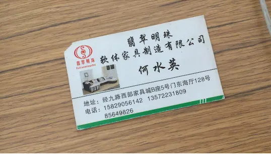
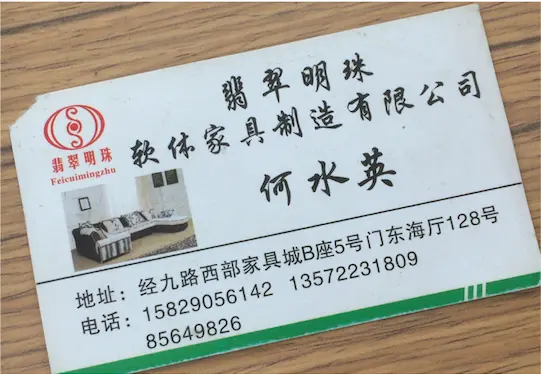
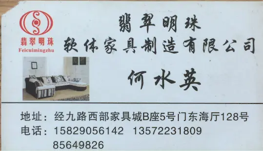
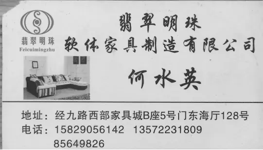
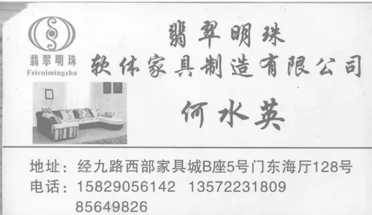
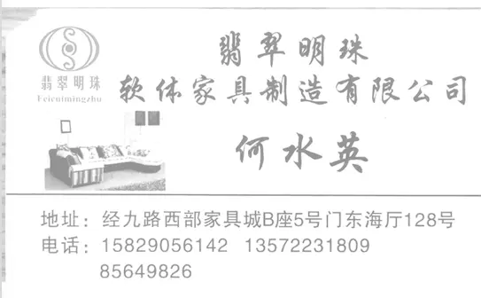
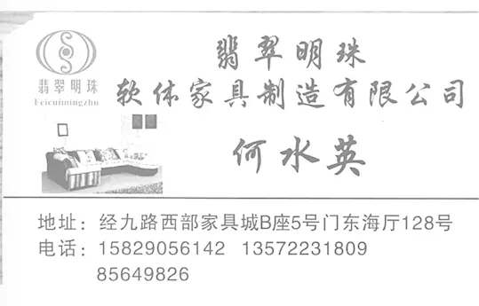
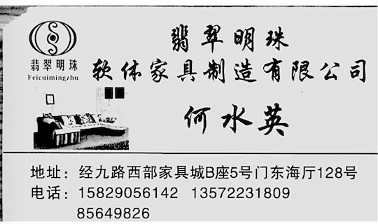
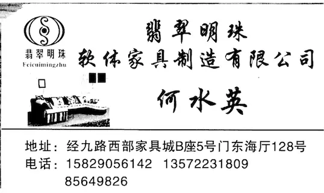

### 1. [iOS 自己实现 名片识别  一  功能分析,模块划分](https://www.jianshu.com/p/52582fff658b)
### 2. [iOS 自己实现 名片识别  二  相机模块制作](https://www.jianshu.com/p/d01614d6c63f)
### 3. [iOS 自己实现 名片识别  三  图片处理](https://www.jianshu.com/p/cb874384a7db)
### 4. [iOS 自己实现 名片识别  四  图片转文字以及归类](https://www.jianshu.com/p/b738edc9414e)

###  主题:  图片处理

#### 声明:下面这些图片仅供学习使用




#### 1.剪切图片
 根据矩形特征剪切图片
```c
// @property (nonatomic , strong) CIImage *img;
//@property (nonatomic , strong) CIRectangleFeature *feature;

_img = [_img imageByCroppingToRect:_feature.bounds];
```


#### 2.图形矫正
根据特征修正图片 , 这一步很重要 , 是否做这一步直接影响识别精度
```c
NSDictionary *para = @{
                           @"inputTopLeft": [CIVector vectorWithCGPoint:_feature.topLeft],
                           @"inputTopRight": [CIVector vectorWithCGPoint:_feature.topRight],
                           @"inputBottomLeft": [CIVector vectorWithCGPoint:_feature.bottomLeft],
                           @"inputBottomRight": [CIVector vectorWithCGPoint:_feature.bottomRight]
                           };
    _img = [_img imageByApplyingFilter:@"CIPerspectiveCorrection" withInputParameters:para];
```


#### 3. 灰度处理
主要用来做文字识别所以直接去掉色彩信息
```c
    CIColor *filterInputcolor = [CIColor colorWithRed:0.75 green:0.75 blue:0.75];
    //只有在主动设置的时候才丢弃颜色信息
    //CIColorMonochrome  单色滤镜
    _img = [_img imageByApplyingFilter:@"CIColorMonochrome" withInputParameters:@{kCIInputColorKey : filterInputcolor}];
```


#### 4.提升亮度
会损失一部分背景纹理 饱和度不能太高
```
    NSDictionary *para = @{
                           kCIInputSaturationKey : @(0.35),  //饱和度
                           kCIInputBrightnessKey : @(0.2),  //亮度
                           kCIInputContrastKey : @(1.1)     //对比度
                           };
    
    //CIColorControls 调整饱和度、亮度和对比度值
    _img = [_img imageByApplyingFilter:@"CIColorControls" withInputParameters:para];
```


#### 5. 曝光调节
```
_img = [_img imageByApplyingFilter:@"CIExposureAdjust" withInputParameters:@{kCIInputEVKey : @(0.65)}];
```


#### 6.高斯模糊
查资料的时候都推荐这个,不过看不懂有什么用
```
_img = [_img imageByApplyingGaussianBlurWithSigma:0.4];
```


#### 7.增强文字轮廓(描边)
```
     NSDictionary* para = @{
             kCIInputRadiusKey : @(2.5),                //获取或设置要检测的最小要素的半径。
             kCIInputIntensityKey : @(0.5),             //获取或设置增强对比度的强度
             };
    
    _img = [_img imageByApplyingFilter:@"CIUnsharpMask" withInputParameters:para];
```


#### 8.调低亮度,增加对比度
使图片字体更黑
```
    NSDictionary *para = @{
                           kCIInputSaturationKey : @(0.35),  //饱和度
                           kCIInputBrightnessKey : @(-0.7),  //亮度
                           kCIInputContrastKey : @(1.9)     //对比度
                           };
    
    //CIColorControls 调整饱和度、亮度和对比度值
    _img = [_img imageByApplyingFilter:@"CIColorControls" withInputParameters:para];
```


#### 9.增加曝光
使上一步调黑的背景变白
```
_img = [_img imageByApplyingFilter:@"CIExposureAdjust" withInputParameters:@{kCIInputEVKey : @(0.65)}];
```


##至此图片的处理已经完成,剩下的就交给识别模块了
>文字位置检测 , 裁剪 (文字位置检测与裁剪实现后,与不裁剪对比,明显不裁剪效果更好,所以把名片作为一个整体来识别了)