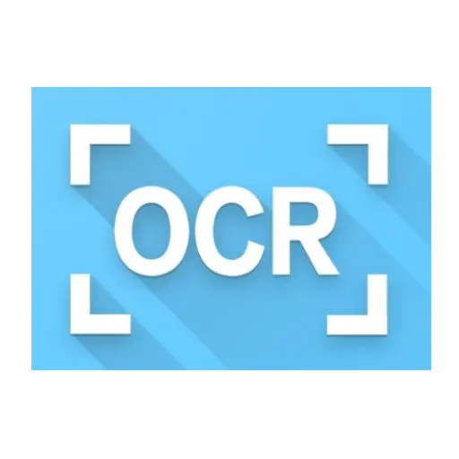
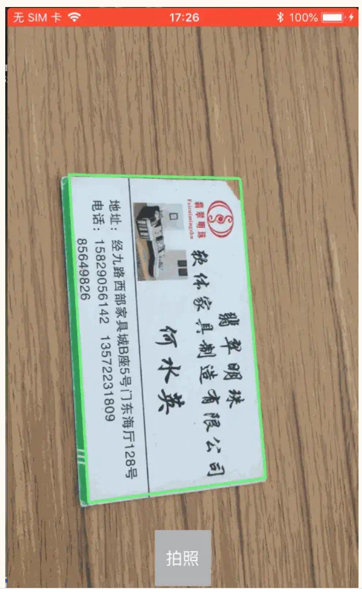

### 1. [iOS 自己实现 名片识别  一  功能分析,模块划分](https://www.jianshu.com/p/52582fff658b)
### 2. [iOS 自己实现 名片识别  二  相机模块制作](https://www.jianshu.com/p/d01614d6c63f)
### 3. [iOS 自己实现 名片识别  三  图片处理](https://www.jianshu.com/p/cb874384a7db)
### 4. [iOS 自己实现 名片识别  四  图片转文字以及归类](https://www.jianshu.com/p/b738edc9414e)



###  主题:相机模块制作

 * 1. 框架的选择与使用
  1.1 相机功能 使用 __AVFoundation__
  1.2 矩形检测: 由于AVFoundation 里面并没有矩形检 测,CoreImage中有矩形检测,Vision中也有矩形检测,但是Vision需要iOS11+才行,最终选中 __CoreImage__ 框架来实现矩形检测
* 2. 相机的使用 
  2.1 展示到屏幕上
  2.2 实现代理获取到视频数据
  2.3 由于矩形的检测并不需要每一帧都去检测,所以我采取10帧检测一次的办法
  2.4 筛选最大矩形
  2.5 展示最大矩形
  2.6 点击拍照后,将照片与特征传入Result

### 效果




## 下面来看看具体实现
####1. 代理的实现
```
- (void)captureOutput:(AVCaptureOutput *)output didOutputSampleBuffer:(CMSampleBufferRef)sampleBuffer fromConnection:(AVCaptureConnection *)connection
{
    // 实现10帧检测一次
    static long count = 0;
    count ++;
    if (count % 10 != 0 ) {
        return;
    }
    
    //1. 生成CIImage
    CVImageBufferRef imageBuffer = CMSampleBufferGetImageBuffer(sampleBuffer);
    CIImage *ciimg = [CIImage imageWithCVImageBuffer:imageBuffer];
    
    //2. 生成矩形特征数组
    NSArray *rectFeatures = [self.detector featuresInImage:ciimg];
    
    //3. 找出最大矩形
    CIRectangleFeature *rectFeature = [self biggestRectInRects:rectFeatures];
    
    NSLog(@"%@---%@",NSStringFromCGRect(rectFeature.bounds) ,NSStringFromCGRect(ciimg.extent));
    
    _currentImg = ciimg;
    _currentRectFeature = rectFeature;
    
    //4. 显示在屏幕上
    [self showRectWithImg:ciimg feature:rectFeature];
}

```
#### 2.从矩形数组中获取最大矩形
```
- (CIRectangleFeature *)biggestRectInRects:(NSArray *)rects
{
    if (rects.count == 0) {
        return nil;
    }
    if (rects.count == 1) {
        return rects.firstObject;
    }
    
    float halfPerimiterValue = 0;
    CIRectangleFeature *biggestRect = [rects firstObject];
    for (CIRectangleFeature *rect in rects)
    {
        CGPoint p1 = rect.topLeft;
        CGPoint p2 = rect.topRight;
        CGFloat width = hypotf(p1.x - p2.x, p1.y - p2.y);
        
        CGPoint p3 = rect.topLeft;
        CGPoint p4 = rect.bottomLeft;
        CGFloat height = hypotf(p3.x - p4.x, p3.y - p4.y);
        
        CGFloat currentHalfPerimiterValue = height + width;
        
        if (halfPerimiterValue < currentHalfPerimiterValue)
        {
            halfPerimiterValue = currentHalfPerimiterValue;
            biggestRect = rect;
        }
    }
    
    return biggestRect;
}
```
#### 3.根据特征,屏幕上画出矩形
```
- (void)showRectWithImg:(CIImage *)img feature:(CIRectangleFeature *)rectFeature
{
    //当连续2次没有检测到矩形的时候 清楚屏幕上的矩形
    static int rectIsNullCount = 0;
    if (rectFeature == nil) {
        rectIsNullCount++;
        if (rectIsNullCount >= 2) {
            rectIsNullCount = 0;
            [self.rectView drawWithPointsfirst:CGPointZero
                                        second:CGPointZero
                                         thrid:CGPointZero
                                         forth:CGPointZero];
            dispatch_async(dispatch_get_main_queue(), ^{
                [self.rectView setNeedsDisplay];
            });
            return;
        }
        return;
    }
    rectIsNullCount = 0;   //检测到矩形,计数清零
    
    CGRect previewRect = self.rect;
    CGRect imageRect = img.extent;
    
    CGFloat scaleW = CGRectGetWidth(previewRect) / CGRectGetHeight(imageRect);
    CGFloat scaleH = CGRectGetHeight(previewRect) / CGRectGetWidth(imageRect);
   
    
    // 由于ciimage 与屏幕 是旋转90度的,所有需要进行调校和等比例缩放才能画出点
    [self.rectView
     drawWithPointsfirst:CGPointMake(rectFeature.topLeft.y * scaleW, rectFeature.topLeft.x * scaleH) second:CGPointMake(rectFeature.topRight.y * scaleW, rectFeature.topRight.x * scaleH) thrid:CGPointMake(rectFeature.bottomRight.y * scaleW, rectFeature.bottomRight.x * scaleH) forth:CGPointMake(rectFeature.bottomLeft.y * scaleW, rectFeature.bottomLeft.x * scaleH)];
    
    dispatch_async(dispatch_get_main_queue(), ^{
        [self.rectView setNeedsDisplay];
    });
}
```

  