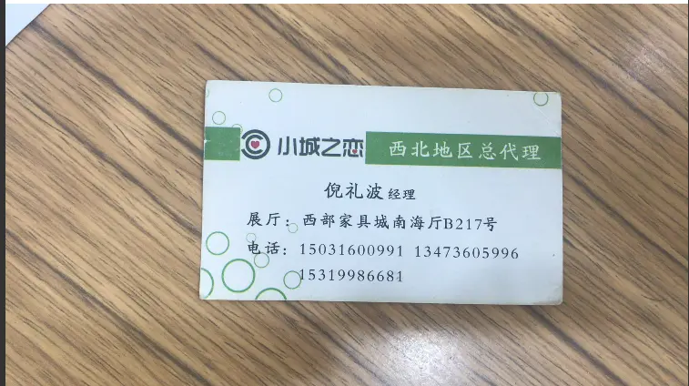
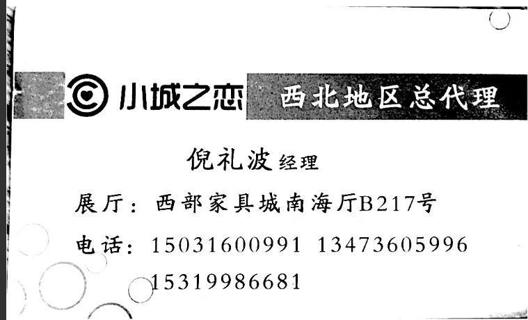
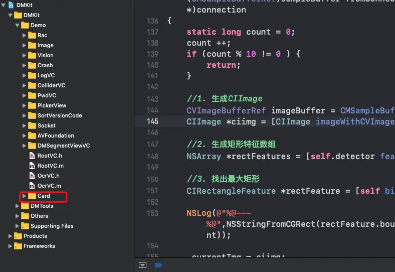

### 1. [iOS 自己实现 名片识别  一  功能分析,模块划分](https://www.jianshu.com/p/52582fff658b)
### 2. [iOS 自己实现 名片识别  二  相机模块制作](https://www.jianshu.com/p/d01614d6c63f)
### 3. [iOS 自己实现 名片识别  三  图片处理](https://www.jianshu.com/p/cb874384a7db)
### 4. [iOS 自己实现 名片识别  四  图片转文字以及归类](https://www.jianshu.com/p/b738edc9414e)

###  本页主题:  图片转文字以及归类

-----
## 先看效果展示
-----
原图:


处理后:



OCR识别效果: 
```
量 U
::; 愧睡酣苒 `:| . -
@ 唧涮区 总 代埋
í
倪礼波经理

展厅: 西部家具城南海厅B217号

电话: 15031600991 13473605996

  / 义-〉15319986681

```
归类后的效果:
```
组织 : 量 U
地址 :  西部家具城南海厅B217号
姓名 : 倪礼波
职位 : 经理
Phone : 15031600991
Phone : 13473605996
Phone : 15319986681
Other :  愧睡酣苒 |
Other : @ 唧涮区 总 代埋
```

### 效果还行,但达不到商用的目标

---
## 实现过程
---
#### 1. 接入OCR模块
这一过程比较复杂,网上也都能查到
#### 2. 图片转文字
```
- (void)tesseractRecognizeImage:(UIImage *)image compleate:(void (^)(NSString *text))compleate
 {
    dispatch_async(dispatch_get_global_queue(DISPATCH_QUEUE_PRIORITY_BACKGROUND, 0), ^{
        G8Tesseract *tesseract = [[G8Tesseract alloc] initWithLanguage:@"chi_sim"];
        tesseract.engineMode = G8OCREngineModeTesseractOnly;
        tesseract.image = image;
        [tesseract recognize];
        //执行回调
        compleate(tesseract.recognizedText);
    });
}
```
### 3.  文字归类
这一块也比较复杂,我制作了中文的归类
1. 去除没用的字符
> NSArray *array = @[@":",@"-",@"\"",@"~",@"/",@"」",@";",@"ˉ",@"`",@"'",@"¢",@"±",@"‘",@"_"];

2. 将字符串按行转换为数组
3. 进行关键字筛选 : 电话,邮箱,qq,web, 地址 
 > 把每一行都进行筛选, 筛选成功后删除该行
4. 检查姓名与职位  (需要用到两张表,  我这里使用了两个txt文件代替表)
> 检测job ,如果job有多余,多余的部分可能为姓名,如果多余的部分不是姓名  则为job的一部分
5. 如果第一行还没有被使用，那么假设第一个标记是组织名称。
6. 如果地址还没有,检查地址
>//检查地址的关键字,有两个或者两个以上关键字则标记为地址
>@[@"省",@"市",@"区",@"路",@"大厦",@"号",@"城",@"室",@"街"];
7. 根据正则重新过滤一遍 web,phone,email,qq 
 列一下正则
```

/** 邮箱 */
- (NSString *)emailRegex
{
    return @"\\w[-\\w.+]*@([A-Za-z0-9][-A-Za-z0-9]+\\.)+[A-Za-z]{2,14}";
}

/** 手机 */
- (NSString *)phoneNumRegex
{
    return @"0?(13|14|15|17|18|19)[0-9]{9}"; //国内手机号
}

/** 电话 */
- (NSString *)telRegex
{
    return @"[0-9-()（）]{7,18}";
}

/** web */
- (NSString *)webRegex
{
    return @"^((https|http|ftp|rtsp|mms)?:\\/\\/)[^\\s]+";
}

/** qq */
- (NSString *)qqRegex
{
    return  @"[1-9]([0-9]{5,11})";
}
```

8. 剩余的则标记为other

---
# THE END !


由于ocr模块比较大,需要代码的小伙伴可以留下联系方式,或者直接与我联系:QQ 258141764

>发现需要代码的人还是挺多的,为了方便传到了百度网盘
>链接:https://pan.baidu.com/s/17LsXgbe3XuOiv9V4sVTVVQ  密码:dzk2
>需要的请自行下载!

>代码所在位置:


# 如果觉得内容对你有所帮助,请帮忙点赞支持,让更多的人看到


