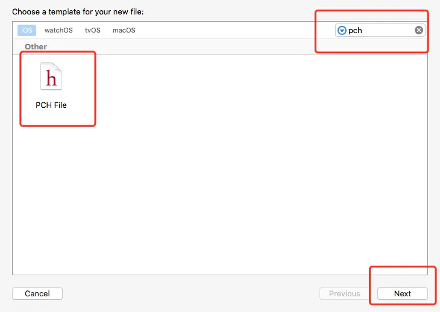
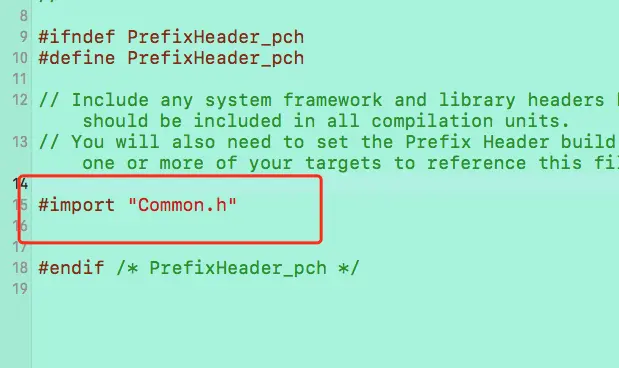
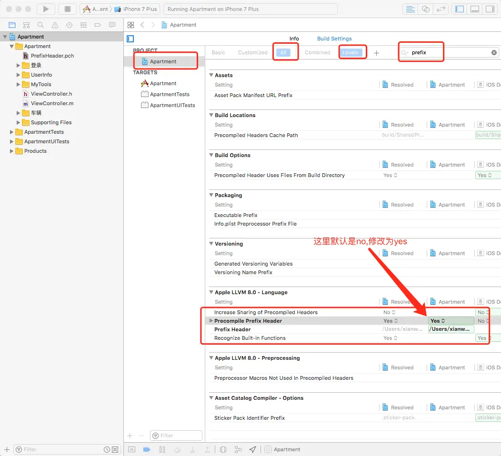
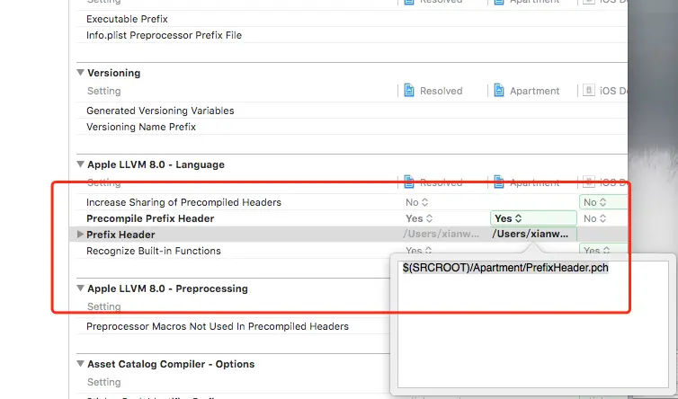

- 1.创建pch文件
- 2.在pch文件中加入要全局使用的头文件
- 3.在工程中加入该pch文件

## 创建pch文件

- 直接创建,不改名字

## 打开该文件,添加需要全局使用的.h文件

## 在工程中加入该pch文件
- 1.查找位置,修改值为yes,如图

- 2.修改路径为:   $(SRCROOT)/Apartment/PrefixHeader.pch   ,其中Apartment为工程名,如图

- 3.编译

# 这样就可以在工程中全局使用了,喜欢的可以点个喜欢

