### 前言

前几天我看了一篇文章, 讲的就是这个, 深有感触, 于是自己用代码撸了一遍

先讲故事 (故事是根据之前的文章写的)

- 有一块沙滩, 上面住着`很多的贝壳` , 贝壳的壳上有着`各种的图案`. 有一天村民发现了这里, 开始`捡贝壳回家`..., 贝壳跟村民回家后的待遇大伙们都懂...
- 但是村民不是什么贝壳都捡, 村民家里有信仰的`图腾`, 当发现贝壳的图案与图腾比较像的时候就跳过, 村民会留下一部分让贝壳们繁衍生息
- 就这样过了 n 代以后 , 你会发现每个贝壳的壳上都长着与图腾很像的图案.

故事讲完了, 这就是 `遗传学` `进化论` 的神奇之处 , 下来我用代码来模拟这一过程

### 定义

```
/// 种群最大数
let populationMaxCount = 100;
/// 种群被筛选后剩余最小数
let populationMinCount = 30;

/// 每个 unit 特征个数
let unitDNACount = 100;
/// 突变概率, 20 代表 20% , 即: 生成model会产生突变的概率;
let mutationRate = 60;

/// 算法按 相同 算还是 相似 算
let isEqualCount = true;

/// 输出结果是按 线 输出还是按 点 输出
let isDrawLine = false;
```

### 主要循环 :

繁衍生息 >> 排序 >> 剔除不像的 >> 输出最像的 >> 是否继续 >\> 繁衍生息

```
 func runLoop(block:(_ datas:[HeredityModel] , _ times:Int)->Bool) {
        var isGoOn = true;
        while isGoOn {
            makeChilds();
            sort();
            weedOut();
            times += 1;
            isGoOn = block(datas,times);
        }
    }
```

### 繁衍生息

- 当少于种群最大值时就繁殖
- 在剩余种群中 找出一对父母 进行繁育

```
// 繁衍生息
    func makeChilds() {
        while datas.count < populationMaxCount - 1 {
            birthChild();
        }
    }
    
    // 造人
    func birthChild() {
        let half = populationMinCount / 2;
        let mother = datas[Int(arc4random()) % half];           // 前半数组中取一个
        let father = datas[Int(arc4random()) % half + half];    // 后半数组中取一个
        
        let child = HeredityModel(father, mother);
        child.makeLikeCount(base: baseModel);
        datas.append(child);
    }
```

### 造物过程

- 取父与母的随机一个 DNA 进行遗传 (遗传学中 DNA 是根据`显性`与`隐性`来遗传的, 代码中就用随机来代表了)
- 根据概率计算其是否需要变异 (没有变异, 物种就不会进化)
- 随机计算要进化的 DNA 的位置

```
    init(_ model1:HeredityModel ,_ model2:HeredityModel) {
        let isMutation = arc4random() % 100 < mutationRate; //是否进行突变
        let index = isMutation ? Int(arc4random()) % unitDNACount : -1;   // 突变位置
        
        for i in 0...unitDNACount-1 {
            if i == index { // 突变
                models.append(HereditySubModel());
            } else { // 正常遗传
                let random = arc4random() % 2;
                let model = random == 1 ? model2 : model1;
                
                models.append(model.models[i]);
            }
        }
    }
```

### 相似度计算

- 基准 DNA 我是画了一条45°的直线
- 按 DNA 相似计算 (物种会很快取向相似 , 并且越来越相似)
- 按 DNA 相同计算 (物种多样性会更好 , 很久以后也存在跳脱的)

```
func makeLikeCount(base:HeredityModel) {
        likeCount = 0;
        for i in 0...unitDNACount-1 {
            if isEqualCount {   // 按基因相同计算
                if (self.models[i].x == base.models[i].x &&
                    self.models[i].y == base.models[i].y) {
                    likeCount += 1;
                }
            } else {    // 按基因相似计算
                likeCount += unitDNACount - abs(self.models[i].x - base.models[i].x);
                likeCount += unitDNACount - abs(self.models[i].y - base.models[i].y);
            }
        }
    }
```

### 成果展示 `基准 DNA 我是画了一条45°的直线`

- 按 DNA 相似计算

    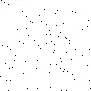1
	
    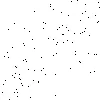
	
    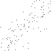
	
    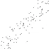
	
    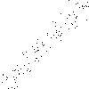
	
    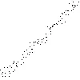
	
    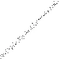
	
    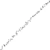
	
    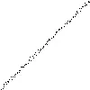
	
    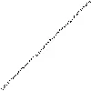
	
    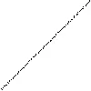
	
    
	
    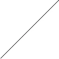

经过 `98239` 代繁育 , 终于进化出`完美的 DNA`

- 按 DNA 相同计算


总共繁衍了 `100000` 代 , 在 `85555` 代的时候已经繁衍出相同数 `99` 的物种了 ,最终也没有进化出完美的 , 并不是说这种进化不出 , 只是运气问题而已

### 总结

通过调整 `定义值` , 会有不同的变化 , 通过这些变化可以看到 `进化论` 中很多神奇的进化过程 .
喜欢的同学可以自己下载演示: [**源码地址**](https://github.com/liu5855019/Heredity) // MacOS代码