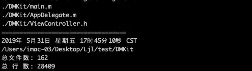

### 先上结果


* 在需要检查的目录下运行脚本就能查询到 __当前目录__ 以及 __子目录__ 下 __.h__  __.m__ 的文件数和行数

* 这样与前一天的结果对比就能知道一天你写了多少代码

### 具体脚本

```
fileCount=0
lineCount=0

function checkFile() {
    file=$1
    if [ "${file##*.}"x = "m"x ]||[ "${file##*.}"x = "h"x ]
    then
        let fileCount=fileCount+1
        while read line
        do
            let lineCount=lineCount+1
        done < ${file}
#        echo ${lineCount}
    fi
}


for file in `find . -name "*.m" -o -name "*.h" `
do
    echo $file
    checkFile $file
done


echo ===================================
date
pwd
echo 总文件数: ${fileCount}
echo 总 行 数: ${lineCount}

```