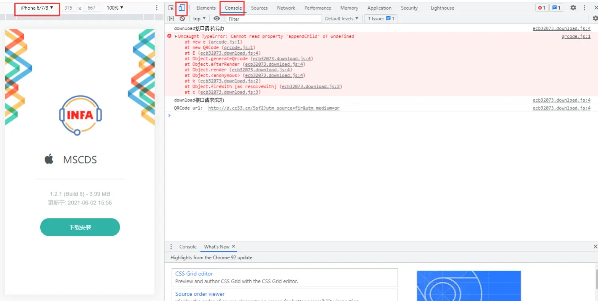
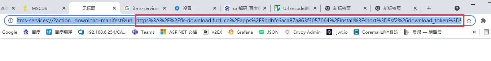

* 1. 在浏览器上输入下载地址

* 2. 进入调试模式

* 3. 用调试模式里的手机模式重新加载, 选iPhone机型, 如图所示

* 4. 点击下载安装,  console 会弹出一条报错信息
* 5. 点击报错信息, 浏览器会弹出新页面打开
* 6. 复制地址的后半段 https 以后的, 如图

* 7. 使用地址解析解析出 install 下载地址, 打开下载地址
* 8. 下载出 install 文件后, 用 文本文档打开, 从中找到真正的下载地址 下载ipa

### the end!

