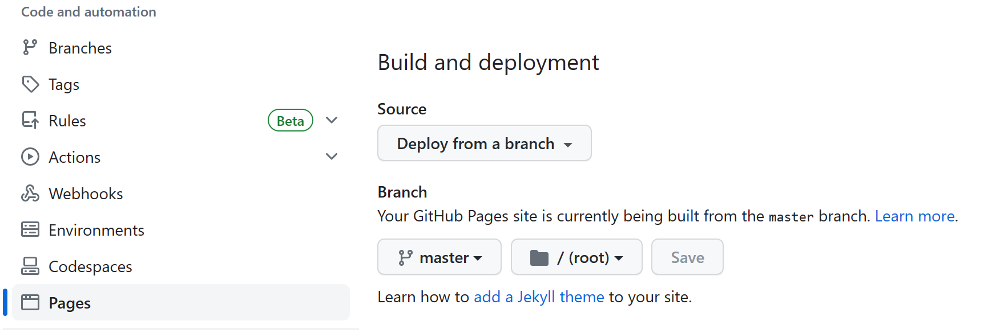

## Joplin 导出, hexo 发布到 github pages
- 支持图片

### Joplin 导出 markdown 后有两个文件夹
- 在 Joplin 里写markdown文章, 直接拖本地图片到编辑区, joplin 会保存图片到_resources文件夹
- 对指定文件夹 _post 点右键导出
- 选择 "markdown+文章前言"
- _post
- _resources
- 将这两个文件夹直接 copy 到 hexo 的 source 目录下

### 调试 hexo
- 直接 hexo s 运行,  此时会发现有文章生成, 但是图片不显示
- debug 后发现生成的文章url与图片路径不匹配
- 解决办法: 修改文章url
```yml
# hexo: / _config.yml
permalink: :title/
```
- 再次 hexo s,  发现还是没有图片
- debug 发现  _resources 文件夹并没有自动copy
- 解决办法: 配置copy _resources 文件夹
```yml
# hexo: / _config.yml
include:
  - _resources/*
```
- 此时 hexo s, 即可看到图片
- hexo g, 发布, 上传到 github.io

### 调试 github.io
- 打开 github pages,  发现还是没有图片
- debug 后, 发现还是无法访问_resources
- 再次检查后, 发现 
	- github.io > setting > pages > build and deployment > deploy from a branch
	- 此选项使用的是 jekyll 来生成 github pages
	- jekyll 默认会跳过 .  _ # 等前缀的文件夹  [参考](https://docs.github.com/zh/pages/setting-up-a-github-pages-site-with-jekyll/about-github-pages-and-jekyll)

	
- 解决办法: 配置 jekyll [参考](https://jekyllrb.com/docs/configuration/default/)
	- 在 github.io 根目录下创建 _config.yml 文件
		```yml
		# github.io: _config.yml
		include: 
		  - _resources
		```
- 此时重新生成,  就会有图片了

### The end