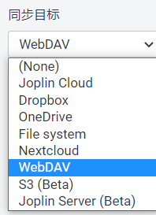

## Joplin 笔记软件
---


### 主要功能/特性
- markdown
	-   完美支持 markdown

- 导入导出
	-  可以导出/导入markdown
	-   支持 tags, title, created, updated 等特性 的导入/导出
	-   可以导出 html

- 同步
	- 需要下载客户端使用
	- 不能再网页中使用
	- 有如下多种同步模式

	- 可以使用 docker 部署 Joplin Server 进行同步
	- WebDAV 同步
		- 可以配合 AList 把网盘作为备份盘
		- 可以配合 AList 把服务器目录作为备份盘 
			```bash
			# ***: alist 服务器地址
			# /dav: 固定
			# /joplin : alist 挂载目录
			http://***/dav/joplin
			```


### 地址

-   [中文 官网](https://joplinapp.org/cn/)
-   [GitHub](https://github.com/laurent22/joplin/)


